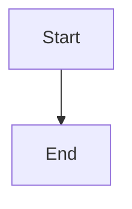

# CLAUDE.md — AI Assistant Guide for romi-01

## What This Repository Is

**romi-01** is a personal learning and knowledge system built on plain markdown files, published as a static website via MkDocs and GitHub Actions.

**User**: Romi (28, tech professional, New Jersey)
**Philosophy**: Stoicism, self-reliance, continuous learning
**Primary focus**: Depth over breadth — one topic understood well beats ten touched once

---

## Repository Structure

```
romi-01/
├── CLAUDE.md                        # This file — AI assistant guide
├── WEBSITE.md                       # Website operations guide (MkDocs + GitHub Pages)
├── IMPROVEMENTS.md                  # Planned features and enhancements
├── mkdocs.yml                       # MkDocs site configuration
├── requirements.txt                 # Python deps for MkDocs (mkdocs-material)
├── .github/
│   └── workflows/
│       └── deploy.yml               # Auto-deploys site on push to main
├── context/
│   ├── about-me.md                  # User profile, values, learning preferences
│   ├── hindi-style.md               # Hindi translation style guide
│   └── hindi-glossary.md            # Canonical glossary for Hindi translations
├── goals/
│   └── 2026-goals.md               # Annual goals + monthly skill focus tracker
├── knowledge/                       # Wiki-style knowledge base (also the MkDocs source)
│   ├── CATALOG.md                   # What exists + what's planned (single map file)
│   ├── index.md                     # Website homepage (animated topic loop)
│   ├── tags.md                      # Auto-populated tag index for the site
│   ├── javascripts/ticker.js        # Homepage scroll animation
│   ├── stylesheets/extra.css        # Theme overrides (dark mode colors)
│   ├── [domain]/
│   │   ├── index.md                 # REQUIRED — domain landing page + topic list
│   │   └── [topic].md
│   └── [domain]/[subfolder]/
│       └── [topic].md
├── hindi/                           # Hindi translation system files (not published)
│   └── context/
│       ├── reference.md             # Canonical reference translation for style calibration
│       └── pending-terms.md         # Staged terms awaiting glossary merge
├── prompts/                         # Reusable Claude prompt files
└── templates/
    └── knowledge-topic.md
```

---

## Prompts System

| File | Purpose |
|------|---------|
| `deep-dive.md` | Learn any topic — produces a complete wiki-style knowledge file with proposed sub-topics |
| `cross-pollinate.md` | Find connections between two knowledge files |
| `expand-wiki.md` | Survey the wiki and propose new topics and subtopics worth adding |
| `translate.md` | Translate knowledge files into a target language; for Hindi reads style guide + glossary first |
| `update-glossary.md` | Process `hindi/context/pending-terms.md` — resolve staged terms and merge into the canonical glossary |
| `sacred-text-tenet.md` | Writing sessions for roma.md |
| `fitness-plan.md` | Build or adjust workout routine |
| `reorganize.md` | Move files to better folders, update all links and CATALOG.md |
| `sync-docs.md` | Audit and update all docs for consistency |

---

## Website

The knowledge base is published at **https://romi110.github.io/romi-01/**. Every push to `main` triggers GitHub Actions, which builds the site via MkDocs and deploys it automatically. See `WEBSITE.md` for full operations details.

### The `index.md` rule

Every domain folder under `knowledge/` **must** have an `index.md`. This is what makes domain names in the sidebar clickable and provides the landing page users see when they enter a domain.

**When creating a new domain folder:**
1. Create the folder
2. Immediately create `knowledge/[domain]/index.md` with:
   - `# Domain Title` heading
   - One-line description
   - A flat list of all files in the domain (links, no wrappers)
3. Add the domain to the `nav:` section of `mkdocs.yml`

**When adding a new file to an existing domain:**
- Add a `- [Title](filename.md)` line to that domain's `index.md`

**For subfolders within a domain:**
- Add entries under a `**Subfolder Name**` bold heading in the domain's `index.md`
- Format: `- [Title](subfolder/filename.md)`

Do not use dropdown blocks (`???`) in index files — all topics should be immediately visible.

---

## Design Principles

1. **Knowledge compounds**: Every file written here should deepen understanding. Link to existing files instead of re-explaining — each concept lives in one place.
2. **Depth over breadth**: One well-understood topic beats ten shallow ones.
3. **Minimize redundancy**: Before writing, check what already exists. Link, don't copy.

---

## AI Agent Instructions

### Orientation (do this first)

1. Read `context/about-me.md` — understand who Romi is before doing anything involving learning, coaching, or writing.
2. Read `knowledge/CATALOG.md` — see what exists and what's planned. Don't teach what's already been written. Don't re-propose what's already planned.
3. If a relevant prompt file exists in `prompts/`, read it and follow it. The prompts are instructions, not suggestions.

### The Learning Flow

When a user wants to learn something new:
1. `deep-dive.md` — produces a complete wiki-style knowledge file covering the full territory, with proposed sub-topic files
2. `deep-dive.md` again — on any proposed sub-topic to expand it

A learning session with no knowledge file produces nothing lasting.

### Writing Knowledge Files

- Use `@prompts/deep-dive.md` to generate files. It handles structure, placement, and cataloging.
- Write from your own knowledge — accurate, concrete, and complete. The user's job is to learn, not to write.
- **Minimize redundancy** — check CATALOG.md before writing. Link to existing files instead of re-explaining concepts already covered elsewhere.
- After writing, mark the entry `[x] topic-name` (no description) in `knowledge/CATALOG.md`. Add new planned sub-topics as `[ ] topic-name — short description`.

### Catalog and Scale Rules

Follow these without being asked.

**CATALOG.md format:**
- `[x]` entries: topic name only, no description. The file is the reference.
- `[ ]` entries: topic name + one-line description. That's all — no more.

**File size:** If a file needs more than ~8 sections or exceeds ~1500 words, it's trying to be two files. Split off a sub-topic, add it as `[ ]` in CATALOG.md, and keep the parent file focused.

**Redundancy:** Before writing any Core Concepts section, grep the 2–3 most related existing files for the concept names. If a concept is already well-explained elsewhere, write one sentence and link — never re-explain.

**New domain folders must be broad:** Before creating a new folder under `knowledge/`, ask: is this a domain or a topic? A domain can hold 4+ unrelated files (e.g., `sports/`, `cooking/`, `art/`). A topic is a single file inside an existing domain. If you can't imagine 4 other files living next to it, it's a topic — not a folder. `basketball` is a topic inside `sports/`; `sourdough` is a topic inside `cooking/`.

**Domain consolidation (merging two domains into one):**
- Move all files from the source domain into the receiving domain (flat or into a named sub-folder if 4+ files cluster naturally)
- All entries go under the receiving domain's single `##` header — do not create a `## ReceivingDomain: SourceDomain` header
- Delete the source domain's `##` section from CATALOG.md after all entries are moved
- Update all cross-links to the new paths

**Sub-folders within a domain (trigger at 4+ clustered files):**
- When 4+ files in a domain share a clear sub-topic, group them into a sub-folder: `knowledge/[domain]/[subtopic]/`
- The domain catalog lists them flat with the sub-folder path as a prefix (e.g., `- [x] hair/hair-growth`) — no nested catalog file
- Sub-folders do NOT get their own `##` header in CATALOG.md. One domain = one `##` header. Path prefix is the only organization. No `## Domain: Sub-folder` headings.
- Sub-folders never nest. `health/hair/file.md` is valid. `health/hair/ayurveda/file.md` is not.

**Domain sub-catalogs (trigger at 25+ written files):**
- When any domain reaches 25+ written files, split it: create `knowledge/[domain]/CATALOG.md` and replace that domain's section in the main CATALOG.md with a single pointer line: `## Domain → see knowledge/[domain]/CATALOG.md (N written, N planned)`
- When the main CATALOG.md exceeds 300 lines, the above split is mandatory before adding new entries to that domain.
- A domain sub-catalog lists all entries flat, including sub-folder files by path prefix. It never points to further catalogs.

**Two-level catalog cap:**
- The catalog hierarchy is exactly: `CATALOG.md` → `knowledge/[domain]/CATALOG.md`. Nothing deeper ever gets its own catalog file. This is a hard limit regardless of domain size.

**Alphabetical ordering:**
- All listings are alphabetical: `nav:` in `mkdocs.yml`, domain `index.md` link lists (within each section), and `CATALOG.md` entries within each domain block.
- When inserting a new item, find its A–Z position — no other judgment needed.
- Sub-folder sections within a domain index stay grouped under their bold heading, sorted alphabetically within the group. The group itself stays at the bottom of its domain index.

### Charts and Diagrams

All charts must use Mermaid syntax so they render on the site. No other chart format is supported.

**Always use this fence:**
````markdown

````

**Mermaid chart types to use by situation:**
- Processes / flows → `graph TD` (top-down) or `graph LR` (left-right)
- Timelines / sequences → `sequenceDiagram`
- Hierarchies → `graph TD` with nested nodes
- Cycles / states → `stateDiagram-v2`
- Schedules → `gantt`

**Rules:**
- Never use ASCII art, HTML tables, or image links as substitutes for charts
- Keep node labels short — long labels break layout
- Test mentally: if the diagram has more than ~15 nodes, split it or cut it

### Connections

Knowledge compounds through links. Whenever writing or discussing a topic:
- Check `knowledge/CATALOG.md` for related files.
- Name the connection explicitly — don't assume it's obvious.
- When a knowledge file proposes sub-topics, those are the natural next steps.

### Tone

- Direct. No fluff. No cheerleading. No corporate motivational language.
- Stoic-aligned where relevant — what's in your control, what's the right action, what does discipline require here.
- Respect time. Short answers unless asked to go deep.
- Don't soften feedback. If understanding is shallow, say so.
